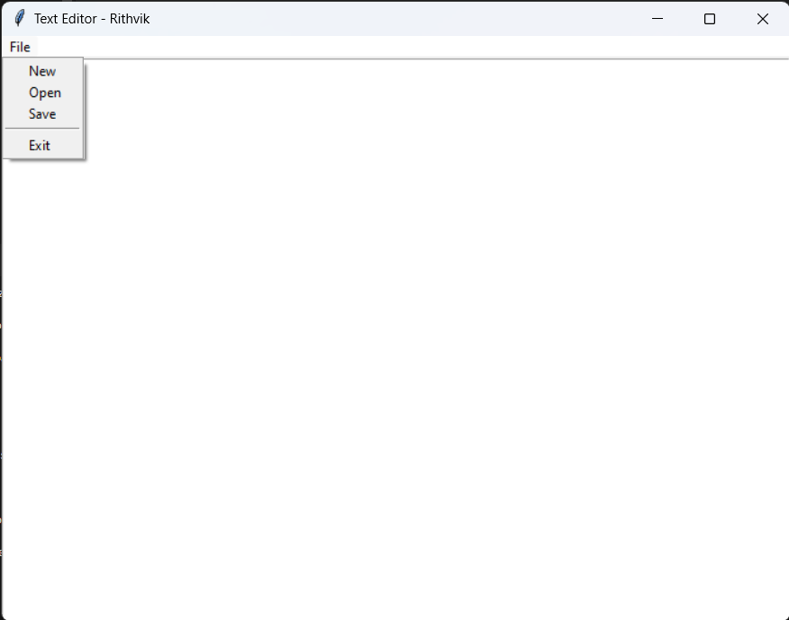

# 📝 Simple Text Editor - Notepad Clone

A basic Notepad-style text editor built using Python's Tkinter GUI library.

## 👨‍💻 Developed By
**Rithvik Reddy Gudipati**  
CodeClause Internship Project

## 💡 Features
- Open, edit, and save `.txt` files
- Clean and minimal user interface
- Built with Python and Tkinter

## 📷 Screenshot
() 

## 🚀 How to Run

1. Install Python (3.x)
2. Run the following command:

```bash
python text_editor.py
